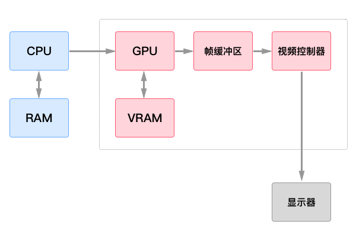

# Flutter 工作原理简介

* 绘图基本原理（OpenGL）
* Flutter 框架设计
* Dart 语言
* Flutter 布局机制
* Flutter 渲染管线
* Flutter 引擎
* Flutter Vs WebView
* Flutter Vs ReactNative

## 绘图基本原理
我们先回顾一下计算机屏幕的绘图原理过程：

* CPU 将计算好的显示内容提交给 GPU
* GPU 使用 VRAM 中的数据和命令，完成图像渲染
* 将渲染好的结果存入`帧缓冲区` (FrameBuffer)
* 然后`视频控制器`将`帧缓冲区`的数据传递给显示器显示

*帧缓冲区：简称帧缓存或显存，它是屏幕所显示画面的一个直接映象，又称为位映射图(Bit Map)或光栅。帧缓存的每一存储单元对应屏幕上的一个像素，整个帧缓存对应一帧图像。*

当然，Android、iOS 的 UI 渲染过程也是如此，Flutter 也是如此，在整个 Flutter 架构中，

## 参考：

* https://tech.meituan.com/waimai-flutter-practice.html
* https://zhuanlan.zhihu.com/p/37438551
* https://zhuanlan.zhihu.com/p/36861174
* https://github.com/flutter/engine/wiki
* https://blog.csdn.net/lanchunhui/article/details/52857160
* http://www.twinklingstar.cn/2015/1532/introduce-to-opengl/