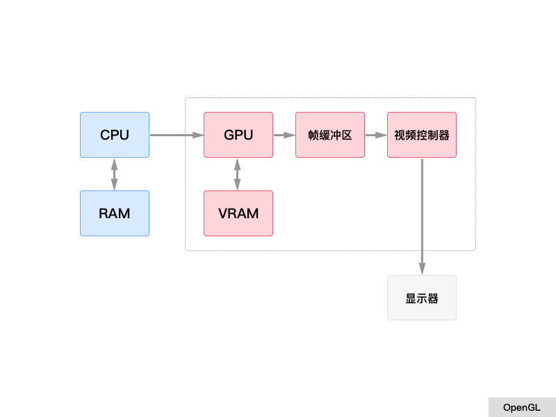
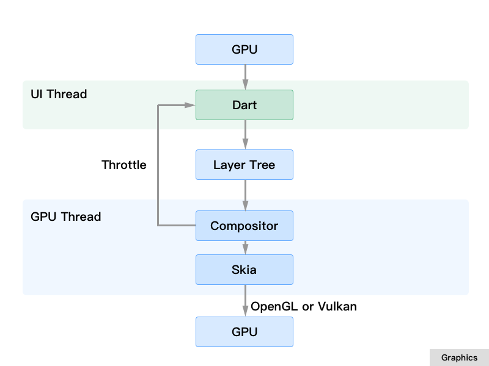

# Flutter 工作原理简介

* 绘图基本原理（OpenGL）
* Flutter 框架设计
* Flutter 布局机制
* Flutter 部件生命周期&状态控制
* Flutter 渲染
* Flutter 引擎
* Flutter 工程结构简介
* Flutter Vs WebView
* Flutter Vs ReactNative

## 绘图基本原理
我们先回顾一下计算机在屏幕上的绘图原理过程：

* CPU 将计算好的显示内容提交给 GPU
* GPU 使用 VRAM 中的数据和命令，完成图像渲染
* 将渲染好的结果存入`帧缓冲区` (FrameBuffer)
* 然后`视频控制器`将`帧缓冲区`的数据传递给显示器显示

*帧缓冲区：简称帧缓存或显存，它是屏幕所显示画面的一个直接映象，又称为位映射图(Bit Map)或光栅。帧缓存的每一存储单元对应屏幕上的一个像素，整个帧缓存对应一帧图像。*

当然，Android、iOS 的 UI 渲染过程是如此，Flutter 也是如此，在整个 Flutter 架构中，Flutter 只关心向 GPU 提供显示数据，并不关心显示器、视频控制器以及 GPU 是如何工作的。

* `GPU`将信号同步到 `UI 线程`
* `UI 线程`用`Dart`来构建`图层树`
* `图层树`在`GPU 线程`进行合成
* 合成后的`视图数据`提供给`Skia 引擎`
* `Skia 引擎`通过`OpenGL 或者 Vulkan`将显示内容提供给`GPU`

## Flutter 框架设计
Flutter 整体框架是由 Dart 语言来实现的，它的层次非常清晰，每层（模块）的职责也相对单一，整个结构让 Flutter 框架在使用上来说更加容易和学习。框架的底层是 Flutter 引擎，它负责绘图、动画、网络、Dart 运行时等功能，是由 C++ 实现的，我们会在接下来的章节中介绍。

* Framework
    * Meterial, Cupertino：针对 Android 的 Meterial 风格，和针对 iOS 的 Cupertino 风格；
    * Widgets：按钮、文本、输入框、图片等组件；
    * Rendering：渲染层，负责布局、绘制、合成等；
    * Animation, Painting, Gestures：动画、绘图、手势；
    * Foundation：最底层，提供上层需要使用的工具类和方法；
* Engine
    * Skia：图形绘制
    * Dart：语言运行时
    * Text：纹理

## Flutter 布局机制
Flutter 提供众多的布局组件，这一点和其它 Web 前端框架的差别非常大，种类如下：

* 单个子元素的布局
    * Container
    * Padding
    * Center
    * Align
    * ... 多达18种
* 多个子元素的布局
    * Row
    * Column
    * Stack
    * ... 多达11种

Flutter 如此繁多的布局组件，对于开发者来说学习难度非常大，并且在不同的页面采用适合的组件非常难选，并且在复杂的布局结构中组件的嵌套非常的深和复杂，这几点绝对让一个 Web 前端开发人员鄙视。或许未来 Flutter 会有更加对开发人员友好的布局设计。

## Flutter 部件生命周期&状态控制
Flutter 框架的 UI 是基于 Widget 的，一切皆 Widget，与 Vue、React 等前端框架一样，部件有自己的生命周期：

## Flutter 渲染
Flutter 界面渲染分三个阶段：布局、绘制和合成。布局和绘制是在 Flutter 框架层完成的，合成则是由 Flutter 引擎来完成的。

* `动画`的运行会改变部件状态（update state）
* 状态的改变会触发`图层树`的重建
* 根据新旧`图层树`的差异更新`渲染树`
* 新的`渲染树`合成新的`图层列表`
* 重新输出`图层树`

## Flutter 引擎
Flutter 引擎是由 C++ 实现的，主要包含：Skia、Dart和Text 三大部分：

* Skia：是由 Google 提供的二维图形框架，包含字型、坐标转换，以及点阵图都有高效能且简洁的表现。它运用在在 Chrome、Android、Firefox 等产品上。
* Dart：是 Dart 语言的运行时。
* Text：文字布局？？

## Flutter 工程结构简介
通过 Flutter 插件可以自动创建 Flutter 项目，目录结构如下：

* android：Android 原生项目
* build
* ios：iOS 原生项目
* lib：Flutter 项目源代码
* test：单元测试
* .metadata
* .packages
* pubspec.lock：项目所有依赖，一颗依赖树
* pubspec.yaml：项目主依赖配置

## Flutter Vs WebView

## Flutter Vs ReactNative

## 参考：

* https://tech.meituan.com/waimai_flutter_practice.html
* https://www.jianshu.com/p/e6cd8584fdbb
* https://zhuanlan.zhihu.com/p/37438551
* https://zhuanlan.zhihu.com/p/36861174
* https://github.com/flutter/engine/wiki
* https://blog.csdn.net/lanchunhui/article/details/52857160
* https://blog.csdn.net/chichengjunma/article/details/82078241
* OpenGL：http://www.twinklingstar.cn/2015/1532/introduce-to-opengl/
* https://www.brainmobi.com/blog/flutter-the-new-standard-in-mobile-app-development/
* https://www.imooc.com/article/details/id/31493
* https://medium.com/saugo360/flutters-rendering-engine-a-tutorial-part-1-e9eff68b825d