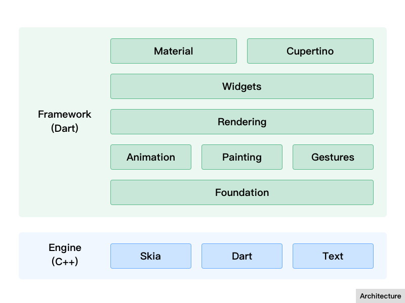

# Flutter 工作原理简介

* 绘图基本原理（OpenGL）
* Flutter 框架设计
* Flutter 布局机制
* Flutter 渲染
* Flutter 引擎
* Flutter Vs WebView
* Flutter Vs ReactNative

## 绘图基本原理
我们先回顾一下计算机在屏幕上的绘图原理过程：

* CPU 将计算好的显示内容提交给 GPU
* GPU 使用 VRAM 中的数据和命令，完成图像渲染
* 将渲染好的结果存入`帧缓冲区` (FrameBuffer)
* 然后`视频控制器`将`帧缓冲区`的数据传递给显示器显示

*帧缓冲区：简称帧缓存或显存，它是屏幕所显示画面的一个直接映象，又称为位映射图(Bit Map)或光栅。帧缓存的每一存储单元对应屏幕上的一个像素，整个帧缓存对应一帧图像。*

当然，Android、iOS 的 UI 渲染过程是如此，Flutter 也是如此，在整个 Flutter 架构中，Flutter 只关心向 GPU 提供显示数据，TODO...

## Flutter 框架设计
Flutter 整体框架是由 Dart 语言来实现的，它的层次非常清晰，每层（模块）的职责也相对单一，整个结构让 Flutter 框架在使用上来说更加容易和学习。框架的底层是 Flutter 引擎，它负责绘图、动画、网络、Dart 运行时等功能，是由 C++ 实现的，我们会在接下来的章节中介绍。

* Framework
    * Meterial, Cupertino：针对 Android 的 Meterial 风格，和针对 iOS 的 Cupertino 风格；
    * Widgets：按钮、文本、输入框、图片等组件；
    * Rendering：渲染层，负责布局、绘制、合成等；
    * Animation, Painting, Gestures：动画、绘图、手势；
    * Foundation：最底层，提供上层需要使用的工具类和方法；
* Engine
    * Skia：图形绘制
    * Dart：语言运行时
    * Text：文字排列

## Flutter 布局机制
TODO...

## Flutter 渲染
Flutter 渲染层

## Flutter 引擎

## 参考：

* https://tech.meituan.com/waimai-flutter-practice.html
* https://zhuanlan.zhihu.com/p/37438551
* https://zhuanlan.zhihu.com/p/36861174
* https://github.com/flutter/engine/wiki
* https://blog.csdn.net/lanchunhui/article/details/52857160
* https://blog.csdn.net/chichengjunma/article/details/82078241
* http://www.twinklingstar.cn/2015/1532/introduce-to-opengl/
* https://www.brainmobi.com/blog/flutter-the-new-standard-in-mobile-app-development/