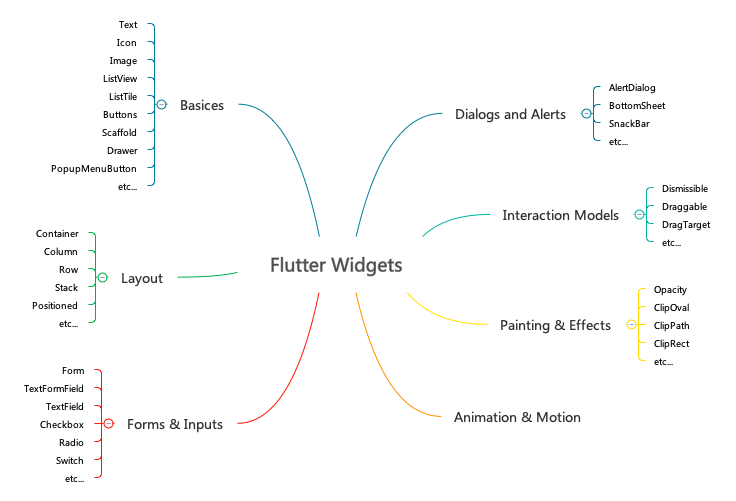

# Flutter 常用部件简介
Flutter 提供了大量的 Widget，种类繁多，就是布局组件就多达 30 个，我们就不一一介绍，只介绍比较常用的一些。在介绍组件之前，我们先了解一下 Flutter 部件的不同种类，在 Flutter 的官方文档中，对所有部件的分类比较混乱，不同类型的部件之间有很多交叉现象，例如：Container 既属于基础部件又属于布局类型的部件；Image 部件同时在基础类型和 Material 类型中，并且还专门为资源类型的部件（Icon、RowImage 等）定义了一个类别。个人感觉它的分类比较混乱，因此我试着重新梳理一下 Flutter 的常用部件类型，以便于学习使用。

* Basics
* Forms and Inputs
* Layout
* Dialogs and Alerts
* Interaction Models
* Animation and Motion
* Painting and effects



## StatelessWidget vs StatefulWidget
在介绍各种不同的部件之前，我们先了解一下什么是`无状态部件`和`有状态部件`。无状态部件，它内部的状态是来自父组件，并且使用 final 类型的变量来存储，当部件被创建的时候，UI 是由这些不可改变的数据构建的，他们都是最终态。那么有状态部件刚好和无状态部件相反，它内部的状态在部件的整个生命周期是可以发生变化的。

**Flutter 诡异的两个基类，这是在做动静分离吗？性能的考虑吗？个人觉得大可不必，在实际项目中绝大多数 UI 都需要**

## 常用 Widgets

* Basics: 
    * Text & Image & Icon
    * ListView & ListTile
    * Buttons
    * Scaffold & Appbar & Drawer & PopupMenuButton
* Forms and Inputs: 
    * Form
    * TextFormField & TextField 
    * Checkbox & Radio & Switch
    * Date & Time Pickers
* Layout: 
    * Container & Padding & Center & Positioned
    * Column & Row & Stack & GridView
* Dialogs and Alerts:
    * AlertDialog
    * SnackBar
    * BottomSheet
* Interaction Models
* Animation and Motion
* Painting and effects

## 常用基础部件（Basics）

### Text & Icon & Image
Text & Image & Icon 是 UI 中最基础的信息显示部件，这些部件就不做详细的介绍，因为作为前端工程师，用的最多最熟悉的也就是这些部件，直接看代码：

```
Column(
    children: <Widget>[
        Text('Text Widget'),
        Image.network('https://metaimg.baichanghui.com/appdownload.jpg'),
        Icon(Icons.help),
    ]
)

```

### ListView & ListTile
ListView & ListTile 这类组件，主要是解决大量列表数据的展示和交互。ListView 为列表的主体部分，它可以绑定数据集合，并且滚动时可以和远程数据进行交互，当然也可以对列表项的数据进行不同的布局展示。ListTile 为列表项的布局，它是基于 Material Design 设计出来的一种特殊布局的部件。

```

List<String> listData = ['a', 'b', 'c', 'd'];

//...

ListView.builder(
    itemCount: 4,
    itemBuilder: (context, index) {
        String item = listData[index];

        return ListTile(
            title: Text(item),
            subtitle: Text(index.toString())
        );
    }
);
```

### Buttons
在 Flutter 部件中有各种不同风格的按钮，例如：IconButton、FlatButton、RaisedButton、RawMaterialButton 等等，其实它们仅仅是风格不同，用处没有太大的差别：

```
Column(
    children: <Widget>[
        FlatButton(
            color: Colors.black,
            textColor: Colors.white,
            child: Text('Button'),
            onPressed: () { },
        ),
        IconButton(
            icon: Icon(Icons.help),
            iconSize: 20,
            color: Colors.black,
            onPressed: () { },
        )
    ]
)
```

**他们在初始化是，有一个必须要初始化的属性 `onPressed`**

### Scaffold & Appbar & Drawer & PopupMenuButton
这一组部件也是基于 Material Design 设计出来的，它们主要解决 App 的导航、辅助功能等问题，当然它也会帮你适配页面在不同设备下的表现。下面的代码中，会出现上述所有组件，让我们分享一下代码：


```
Scaffold(
    appBar: Appbar(
        title: Text('Title'),
        actions: <Widget> [
            PopupMenuButton(
                itemBuilder: (context) {
                    return [
                        PopupMenuItem(
                            value: '',
                            child: Text('Item1')
                        )
                    ];
                }
            )
        ]
    ),
    drawer: Drawer(
        child: Column(),
    ),
    body: Container(),
)
```

* Scaffold：Material Design 布局结构的基本实现
    * appbar: Appbar：引用程序栏
        * title：标题
        * actions：操作部件
            * PopupMenuButton：弹出菜单按钮
                * PopupMenuItem：菜单项
    * drawer: Drawer：侧边抽屉导航
    * body：应用程序主体


## 表单部件（Forms and Inputs）
我们通过表单来收集用户填写的相关信息，和 Web 中的表单类似，Flutter 提供了表单中常用的文本输入、单选、多选和开关等部件，并且它也提供了基本的表单校验的功能，以及满足我们通常的业务。

```
Form(
    key: _formKey,
    child: Column(
        children: <Widget>[
            TextFormField(
                validator: (value) {
                    if(value.isEmpty) {
                    return 'Please enter some text';
                    }
                },
            ),
            Checkbox(
                value: false,
                onChanged: (value) { },
            ),
            Radio(
                value: false,
                groupValue: 0,
                onChanged: (value) { },
            ),
            Switch(
                value: false,
                onChanged: (value) {},
            ),
            RaisedButton(
                child: Text('Submit'),
                color: Colors.black,
                textColor: Colors.white,
                onPressed: (){
                if(_formKey.currentState.validate()) {
                        Scaffold.of(context).showSnackBar(SnackBar(
                            content: Text('OK'),
                        ));
                    }
                },
            )
        ],
    ),
);
```

## 布局部件（Layout）
布局部件在 Flutter 中多达 30 个，个人对这种复杂繁多的设计并不是非常满意（或许它有自己的好处），但是对于开发人员来说非常不友好。在布局部件中 Flutter 分两大类：一类是单个子元素的布局部件；另一类是多个子元素的布局部件。我们简单介绍几个较为常用的部件：

* Single-child layout widgets
    * Container：
    * Padding：
    * Center：
    * Positioned：
* Multi-child layout widgets
    * Column：
    * Row：
    * Stack：
    * GridView：

### Container
Container 类似于 Web 中的 `<div>`，我们可以给它设置 `height`、`width`、`padding`、`margin` 等属性：

```
Container(
    child: Text('Container'),
    padding: EdgeInsets.all(10),
    margin: EdgeInsets.all(30),
    height: 250,
    width: 200,
    alignment: Alignment.center,
    decoration: BoxDecoration(
        color: Colors.red,
        border: Border.all(
            width: 3, 
            color: Colors.blue
        ),
        borderRadius: BorderRadius.all(
            Radius.circular(20)
        ),
        image: DecorationImage(
            image: NetworkImage('https://metaimg.baichanghui.com/appdownload.jpg')
        )
    ),
    transform: Matrix4.rotationZ(-0.1),
)
```

### Padding
Padding 可以用来给部件设置内边距，搞不懂 Flutter 的设计思想：

```
Padding(
    padding: EdgeInsets.all(20),
    child: Container(
        child: Text('Padding'),
        color: Colors.green,
    ),
)
```

### Center
What?

```
Center(
    child: Text('Center'),
)
```

### Positioned
Positioned 部件可以对它设置相对位置，让它位于屏幕的不同地方，不过它需要与 Stack 部件配合使用：

```
Positioned(
    left: 100,
    top: 100,
    child: Container(
        color: Colors.green,
        height: 80,
        width: 80,
    ),
)
```

### Column
Column 是纵向布局部件，可以让你对多个部件进行纵向布局，在它内部的子部件会沿屏幕的纵向一个一个显示出来：

```
Column(
    children: <Widget>[
            Container(
            color: Colors.red,
            height: 100,
            width: 100,
        ),
        Container(
            color: Colors.blue,
            height: 100,
            width: 100,
        ),
        Container(
            color: Colors.green,
            height: 100,
            width: 100,
        ),
    ],
)
```

### Row
Row 刚好和 Column 相反，可以让你对多个部件进行横向布局，在它内部的子部件会沿屏幕的横向一个一个显示出来：

```
Row(
    children: <Widget>[
            Container(
            color: Colors.red,
            height: 100,
            width: 100,
        ),
        Container(
            color: Colors.blue,
            height: 100,
            width: 100,
        ),
        Container(
            color: Colors.green,
            height: 100,
            width: 100,
        ),
    ],
)
```

### Stack
Stack 堆叠布局，在 Stack 内部的子部件，会堆叠在一起，我们可以配合 Positioned 部件来设置堆叠于 Stack 内部的位置：

```
Stack(
    children: <Widget>[
        Container(
            color: Colors.red,
            height: 250,
            width: 250,
        ),
        Container(
            color: Colors.blue,
            height: 150,
            width: 150,
        ),
        Positioned(
            left: 100,
            top: 100,
            child: Container(
                color: Colors.green,
                height: 80,
                width: 80,
            ),
        )
    ],
)
```

### GridView
GridView 珊格布局，它在 Web 的响应式设计中经常使用，他的好处在于，可以适应不同的屏幕：

```
GridView.count(
    crossAxisCount: 2,
    children: List.generate(20, (index) {
        return Text(index.toString());
    }),
)
```

## 提醒弹出框部件（Dialogs and Alerts）
提醒和弹出框部件，App 相比起 Web 更加的丰富多样，Web 原生提供的也比较少，我们看看 App 中比较常用的几个：

* AlertDialog
* SnackBar
* BottomSheet

### AlertDialog
AlertDialog 类似于浏览器中的 alert，只不过它可以自定义一些按钮来做不同的事情：

```
FlatButton(
    child: Text('Show Dialog'),
    onPressed: () {
        showDialog(
            context: context,
            builder: (context) => AlertDialog(
                title: Text('Title2'),
                content: Text('Content2'),
                actions: <Widget>[
                    FlatButton(
                        child: Text('OK'),
                        onPressed: () {
                            // do something
                        }
                    )
                ]
            )
        );
    },
)
```

### SnackBar
SnackBar 是类似于很多 UI 框架中的提醒框，它属于非阻断性的提醒：

```
RaisedButton(
    child: Text('Show SnackBar'),
    color: Colors.black,
    textColor: Colors.white,
    onPressed: (){
        Scaffold.of(context).showSnackBar(SnackBar(
            content: Text('Hello!'),
        ));
    },
)
```

### BottomSheet
BottomSheet 是从屏幕底部弹出来的页面，你可以通过它来做一些类似与 Select 部件的功能，当然它内部的内容是可以自定义的：

```
RaisedButton(
    child: Text('Show Bottom Sheet'),
    color: Colors.black,
    textColor: Colors.white,
    onPressed: () {
        showBottomSheet(
            context: context,
            builder: (context){
                return Container(
                    width: MediaQuery.of(context).size.width,
                    child: Text('BottomSheet'),
                );
            }
        );
    },
)
```

## 代码：
* [Basics](../demo/widgets/lib/widget-basics.dart)
* [Forms and Inputs](../demo/widgets/lib/widget-form.dart)
* [Layout](../demo/widgets/lib/widget-layout.dart)
* [GridView](../demo/widgets/lib/widget-grid.dart)
* [Dialogs and Alerts](../demo/widgets/lib/widget-dialogs.dart)

## 总结
Interaction Models、Animation and Motion、Painting and effects 这些都属于比较高级的部件，我们在未来文章中再做介绍。回顾 Flutter 如此繁多的部件，再加上它的有状态部件和无状态部件之分，学习成本相对来说比较高，每一种部件还有这不同的功能属性，这种设计的确讲究软件设计的职责单一，但是在复杂的 UI 场景会导致大量的代码嵌套，代码的维护成本也会随之上升，在 Web 的 Table 布局时代就出现过这样的灾难。作为 Web 工程师，可能对 Flutter 这样的设计非常抱怨，HTML 和 CSS 将组件和样式分离开来，从学习的角度上看所有组件有着它自己的功能，而样式只是组件的附加值，从某种角度上来说这是两个是解藕的，但是 Flutter 部件的学习过程中需要去了解各个部件自己的长相如何设置，在这一点 Web 学习的复杂成本会降低。另外将样式分离开来后，代码嵌套也会随之减少，同样是 DIV 我们可以给它赋予布局、边框、背景、阴影、边距、剪切等样式，但是 Flutter 部件要实现这些功能需要嵌套多个部件才能完成。个人认为 Flutter 在这方面需要继续改进，已迎合现在互联网工程师的口味，这样才能推广开来。
